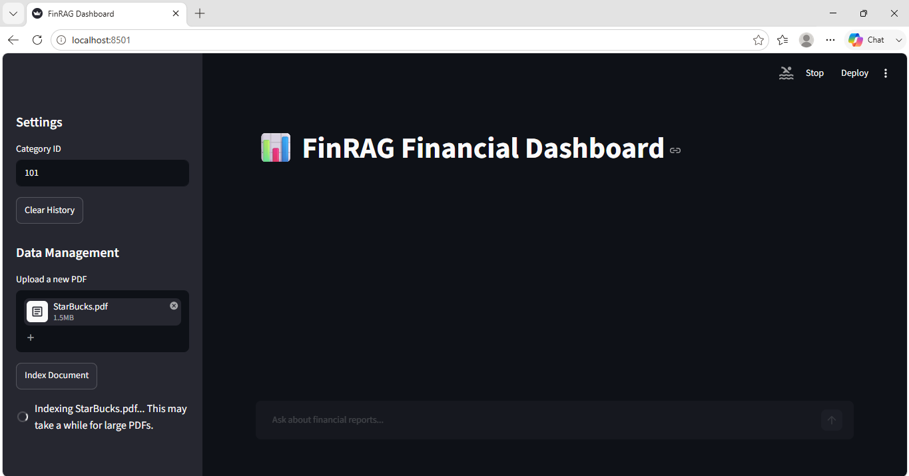
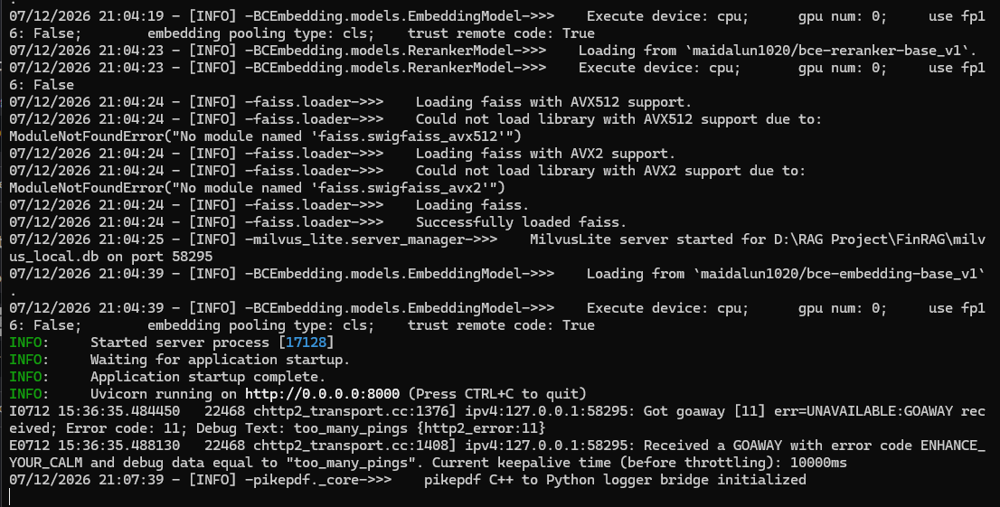
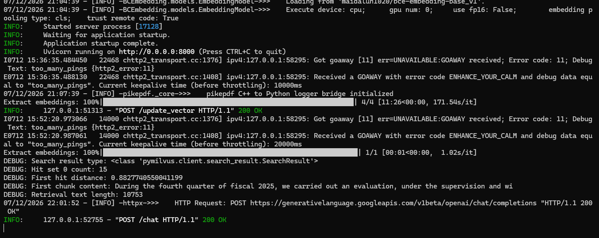
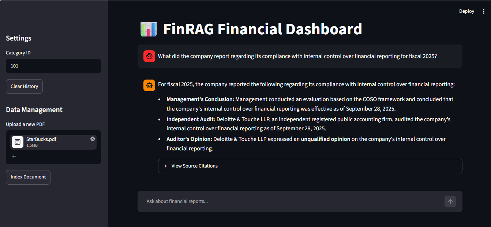

# 📊 FinRAG — Financial Retrieval Augmented Generation

> **Ask questions about financial reports and get accurate, cited answers — powered by RAG.**

FinRAG is a locally-running financial document intelligence platform. Upload any financial PDF (annual reports, 10-Ks, earnings summaries), index it into a vector database, and query it using natural language. The system retrieves the most relevant passages and uses a large language model to generate grounded, cited responses.

---

## 🖥️ Screenshots

### Dashboard — Uploading & Indexing a PDF


### Server — Startup & Embedding Logs


### Dashboard — Querying a Financial Report


### Server — Live Query Logs


---

## ✨ Features

- 📄 **PDF Ingestion** — Upload financial PDFs directly through the Streamlit UI
- 🔍 **Semantic Search** — Dense vector search via MilvusLite + BCEmbedding
- 🎯 **Reranking** — BCEReranker refines retrieval accuracy before generation
- 🤖 **LLM Q&A** — Answers generated with source citations via OpenAI-compatible API
- 📌 **Source Citations** — Every answer links back to the exact passage retrieved
- 🗂️ **Multi-document Support** — Manage multiple PDFs per Category ID
- 🚀 **Fully Local** — Runs offline with local embedding + MilvusLite (no cloud DB required)

---

## 🏗️ Architecture

```
┌─────────────────┐      ┌──────────────────┐      ┌─────────────────────┐
│  Streamlit UI   │─────▶│  FastAPI Backend  │─────▶│  MilvusLite (Local) │
│  (app_ui/)      │      │  (app/)           │      │  Vector Store       │
└─────────────────┘      └──────────────────┘      └─────────────────────┘
                                  │                         ▲
                                  │  embed & rerank         │ vector search
                                  ▼                         │
                         ┌─────────────────┐       ┌───────────────────┐
                         │  BCEmbedding    │───────▶│  BCEReranker      │
                         │  (text → vec)   │       │  (refine results) │
                         └─────────────────┘       └───────────────────┘
                                  │
                                  ▼
                         ┌─────────────────┐
                         │  LLM (OpenAI /  │
                         │  Gemini API)    │
                         └─────────────────┘
```

---

## ⚙️ Prerequisites & Setup

### 1.1 Install Python 3.11

Download and install **Python 3.11** from the official website:

👉 [https://www.python.org/downloads/release/python-3110/](https://www.python.org/downloads/release/python-3110/)

During installation, make sure to check:
- ✅ **Add Python 3.11 to PATH**
- ✅ **Install for all users** (recommended)

Verify the installation by opening **Command Prompt** or **PowerShell**:

```powershell
python --version
# Expected: Python 3.11.x
```

---

### 1.2 Initialize Milvus Vector Database

FinRAG uses **MilvusLite** by default — no Docker required. A local `.db` file (`milvus_local.db`) is created automatically on first run.

For a full Milvus server (optional), start via docker-compose:

```bash
cd docker
docker-compose up -d
```

Milvus UI will be available at `http://{your_server_ip}:3100/`.

---

### 1.3 Download Embedding & Reranker Models

```bash
# Create model directory
mkdir -p /data/WoLLM

# Download BCE Embedding model
git clone https://www.modelscope.cn/maidalun/bce-embedding-base_v1.git /data/WoLLM/bce-embedding-base_v1

# Download BCE Reranker model
git clone https://www.modelscope.cn/maidalun/bce-reranker-base_v1.git /data/WoLLM/bce-reranker-base_v1
```

| Model | Purpose |
|---|---|
| `bce-embedding-base_v1` | Converts text into dense vectors for semantic search |
| `bce-reranker-base_v1` | Refines retrieval results to improve answer accuracy |

> Update `EMBEDDING_MODEL` and `RERANK_MODEL` paths in `conf/config.py` to match your local directory.

---

### 1.4 Python Dependencies

```powershell
# Create virtual environment
python -m venv .venv

# Activate (PowerShell)
.venv\Scripts\activate

# Install all dependencies
pip install -r requirements.txt
```

**Key dependencies:**

| Package | Version | Role |
|---|---|---|
| `fastapi` | latest | Backend API server |
| `streamlit` | 1.58.0 | Frontend dashboard UI |
| `BCEmbedding` | 0.1.5 | Embedding & reranking |
| `pymilvus[milvus-lite]` | ≥ 2.4.2 | Vector store |
| `langchain` | 0.2.0 | RAG pipeline orchestration |
| `pikepdf` | 8.15.1 | PDF parsing |
| `openai` | 1.30.1 | LLM API client |
| `uvicorn` | latest | ASGI server |

---

### 1.5 Configuration

Edit `conf/config.py` to match your environment:

```python
VECTOR_DB_PATH = "milvus_local.db"      # Path to MilvusLite local DB
COLLECTION_NAME = "fin_rag_collection"   # Milvus collection name
EMBEDDING_MODEL = "maidalun1020/bce-embedding-base_v1"
RERANK_MODEL    = "maidalun1020/bce-reranker-base_v1"
```

---

### 1.6 Environment Variables

```bash
# Copy the environment template
cp .env_user .env
```

Open `.env` and fill in your credentials:

```env
# LLM Provider (OpenAI-compatible, e.g. Gemini, Together AI, etc.)
OPENAI_API_KEY=your_api_key_here
OPENAI_BASE_URL=https://generativelanguage.googleapis.com/v1beta/openai/

# Object Storage (optional, for remote PDF storage)
OSS_ACCESS_KEY_ID=your_oss_key
OSS_ACCESS_KEY_SECRET=your_oss_secret
```

---

## 🚀 Launching the Application

### Standard Start

```bash
python main.py
```

### Production Start

```bash
bash bin/start.sh
```

After startup, open your browser and navigate to:

| Service | URL |
|---|---|
| **Streamlit Dashboard** | `http://localhost:8501` |
| **FastAPI Backend** | `http://localhost:8000` |
| **API Docs (Swagger)** | `http://localhost:8000/docs` |

---

## 📋 Usage Guide

1. **Set Category ID** — Enter a numeric ID in the sidebar (e.g. `101`) to namespace your documents.
2. **Upload PDF** — Click the upload area and select a financial PDF (e.g. an annual report).
3. **Index Document** — Click **Index Document** and wait for the embedding process to complete. Progress will be shown in the sidebar.
4. **Ask Questions** — Type a natural language question in the chat input (e.g. *"What did the company report about internal controls for fiscal 2025?"*).
5. **View Citations** — Expand **View Source Citations** under each answer to see the exact passages retrieved.

---

## 🗂️ Project Structure

```
FinRAG/
├── app/                  # FastAPI backend (routes, RAG pipeline)
├── app_ui/               # Streamlit frontend
├── bin/                  # Start/stop scripts
├── conf/                 # Configuration files
├── data/                 # Uploaded documents storage
├── docs/
│   └── screenshots/      # UI screenshots for documentation
├── logs/                 # Application logs
├── milvus_local.db/      # Local MilvusLite vector database
├── storage/              # Processed document storage
├── test/                 # Unit tests
├── utils/                # Shared utility functions
├── config.py             # Root-level config overrides
├── main.py               # Application entry point
├── requirements.txt      # Python dependencies
├── Dockerfile            # Container build definition
└── .env                  # Environment variables (not committed)
```

---

## 🐳 Docker Support

```bash
docker build -t finrag .
docker run -p 8000:8000 -p 8501:8501 --env-file .env finrag
```

---

## 🗺️ Roadmap

- [x] PDF upload & indexing via Streamlit UI
- [x] Local vector search with MilvusLite
- [x] BCE embedding + reranking pipeline
- [x] LLM-powered Q&A with source citations
- [ ] **RAG Optimization**
  - [ ] Multi-level indexing
  - [ ] Multi-query expansion
  - [ ] Query rewriting / optimization
  - [ ] Advanced text parsing pipelines
- [ ] Multi-user support with auth
- [ ] Cloud deployment (AWS / GCP)
- [ ] Support for Excel & Word documents

---

## 🤝 Contributing

Pull requests are welcome! For major changes, please open an issue first to discuss what you would like to change.

---

## 📄 License

This project is licensed under the terms of the [LICENSE](LICENSE) file included in this repository.

---

<div align="center">
  Built with ❤️ using FastAPI · Streamlit · MilvusLite · BCEmbedding
</div>